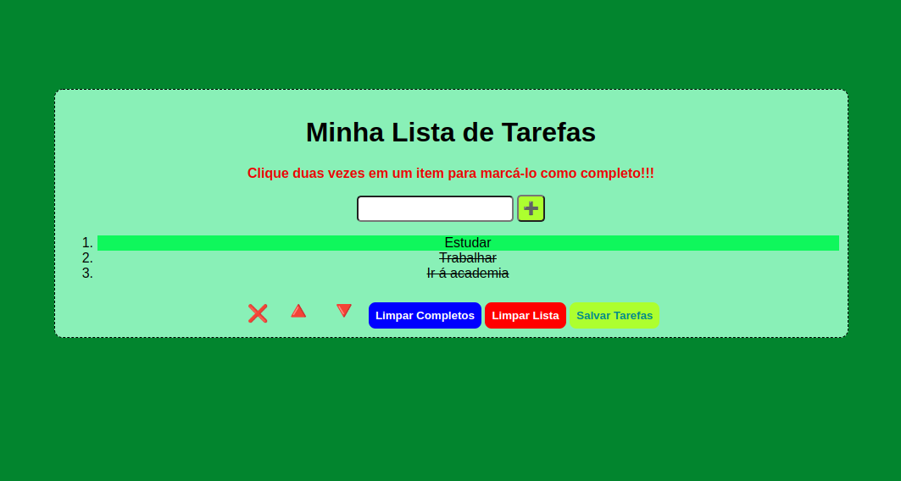

# Project My First To Do List :heavy_check_mark:
Projeto desenvolvido durante o curso da Trybe, para desenvolver esse projeto foi utilizado HTML, CSS e JavaScript.

O objetivo desse projeto foi criar uma lista de tarefas, na qual é possível adicionar e remover tarefas, aumentar e diminuir prioridades e definir a tarefa como completa ao dar um duplo clique sobre a mesma, para realização do projeto foram utilizados recursos como: manipular elementos de uma página HTML e também como remover e adicionar eventos na página, utilizando JavaScript, através do DOM, conceitos como localStorage e SessionStorage para salvar as tarefas mesmo após recarregar a página.

### Demosntração do Projeto:
</img>;

### Link para acessar o projeto: https://jeancarlos-sc.github.io/projetos/to-do-list/
